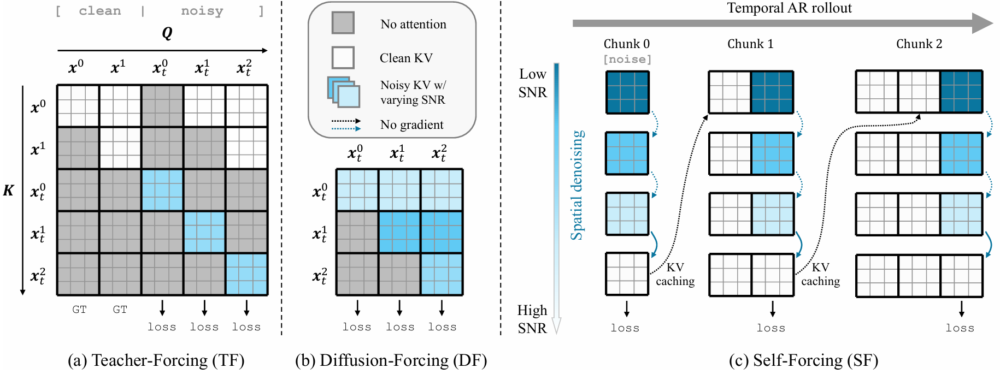
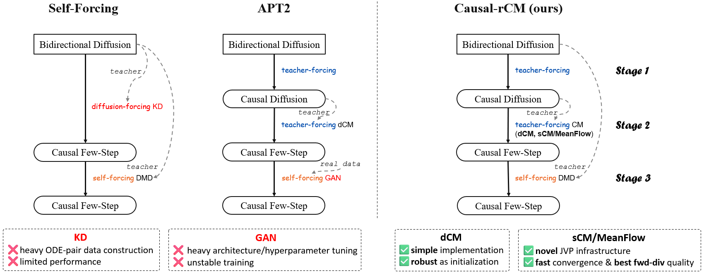
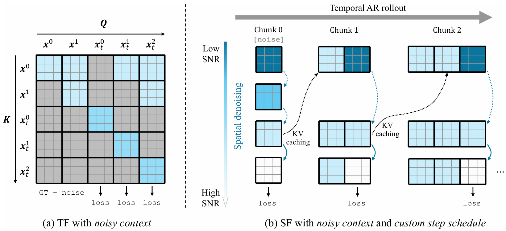
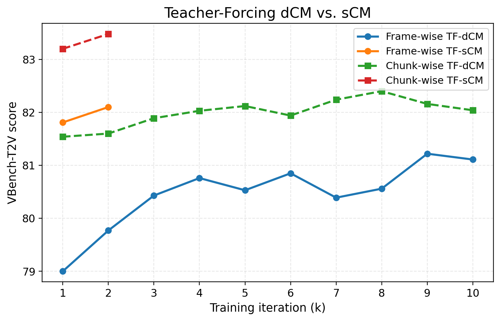

## Overview

Causal-rCM extends rCM from bidirectional few-step video generation to block-causal autoregressive video diffusion. The goal is to keep the streaming behavior of causal models while preserving the rCM recipe: a stable forward-divergence path and an on-policy reverse-divergence path.

The forward path is teacher-forcing CM distillation from a causal teacher. It is stable, offline, and mode-covering: the student learns from real or teacher-generated videos under block-causal masks. The reverse path is self-forcing DMD: the student rolls out its own autoregressive video, and a bidirectional teacher plus fake-score network provide distribution-matching supervision on those on-policy samples. This mirrors the Self-Forcing idea of training on the model's own rollout distribution, while using teacher-forcing CM objective to improve initialization, diversity, and mode coverage.

## Training Modes

<p align="center">
  
</p>

`T2VCausalModel` exposes the following `model.config.training_type` values:

- `tf`: teacher-forcing causal diffusion training with clean ground-truth context.
- `df`: diffusion-forcing causal diffusion training with independently sampled per-chunk noise levels.
- `tf_dcm`: teacher-forcing discrete-time consistency distillation from a causal teacher.
- `tf_scm`: teacher-forcing continuous-time consistency distillation from a causal teacher, using JVP.
- `sf_dmd`: self-forcing DMD on autoregressive student rollouts, using a bidirectional teacher, and a fake-score network.

TF, DF, and teacher-forcing CM objectives are trained in packed form. Replayed backpropagation is now reserved for self-forcing DMD, where the rollout is first built without gradients and the final denoising step is recomputed chunk by chunk for backpropagation. Enable it for `sf_dmd` by using the `_replayed` experiment suffix or setting `model.config.replayed_training=True`.

## Causal-rCM Recipe

The Causal-rCM recipe combines the strengths of [Self-Forcing](https://self-forcing.github.io/) and [APT2](https://seaweed-apt.com/2), while further supporting advanced JVP-based continuous-time consistency (e.g., sCM/MeanFlow) for causal training.

<p align="center">
  
</p>

1. **Train a causal teacher.** Start from a bidirectional Wan2.1 teacher and fine-tune it with `tf` or `df` under block-causal attention.
2. **Distill a causal few-step student with teacher-forcing CM.** Use `tf_dcm` or `tf_scm` with the causal teacher. We recommend starting with `tf_dcm` because it is simpler to implement and more robust as initialization.
3. **Refine with self-forcing DMD.** Use `sf_dmd` to improve the student on its own autoregressive rollouts. The fake-score network is initialized from the bidirectional teacher unless `model.config.fake_score_ckpt` is provided.

## Key Components

- Block-causal masks and KV cache: `rcm/utils/blockmask.py`, `rcm/utils/kv_cache.py`
- Causal Wan backbones: `rcm/networks/wan2pt1.py`, `rcm/networks/wan2pt1_jvp.py`
- Causal training/distillation loop: `rcm/models/t2v_model_causal.py`
- Wan2.1 causal configs: `rcm/configs/experiments/causal_rcm/wan2pt1_t2v.py`
- Causal inference: `rcm/inference/wan2pt1_t2v_causal_infer.py`

## Chunk Patterns

Causal generation operates on latent-frame chunks:

```text
[ first_chunk_t frames | chunk_t frames | chunk_t frames | ... ]
```

The base causal configs set `first_chunk_t=0` and `chunk_t=0` as a template sentinel. Launch a concrete variant or override the values directly:

- `_c1-1`: one initial latent frame, then one-frame chunks.
- `_c3-3`: three initial latent frames, then three-frame chunks.
- `_c1-4`: one initial latent frame, then four-frame chunks.

```bash
model.config.first_chunk_t=1 model.config.chunk_t=1
```

The same `BlockPattern` drives packed training masks, self-forcing replay, inference, I2V generation, and extrapolation.

## Noisy Context

<p align="center">
  
</p>

By default, causal inference appends a clean `t=0` KV state after each generated chunk. This is simple and robust, but it requires an extra clean forward pass per chunk (e.g., 4-step generation requires 5 forward passes per chunk).

Set `model.config.context_from_last_step=True` during training, or pass `--context_from_last_step` during inference, to cache the final denoising forward as the context for later chunks. In training, `_noisy_ctx` perturbs the teacher-forcing ground-truth context to the same time level used by the cached inference context. This makes TF, TF-CM, and SF-DMD see the noisy-context distribution that the sampler will later use, thus saving one forward pass during inference.

`model.config.context_from_last_step_start_chunk` and `--context_from_last_step_start_chunk` control the first chunk that uses noisy context.

## Step Schedules

Few-step Causal-rCM uses rectified-flow times. With `sigma_max=1600`, the first time is `sigma_max / (sigma_max + 1)`, followed by intermediate times and ending at `0`.

The default distilled schedule is:

```text
[sigma_max / (sigma_max + 1), 15/16, 5/6, 5/8, 0]
```

For a 4-step model, this corresponds to `model.config.backward_timesteps=[15/16, 5/6, 5/8]` and inference `--mid_t 15/16 5/6 5/8`.

In the self-forcing stage, we can train with a smaller number of generation steps. In T2V generation, the first chunk is critical. We therefore use 4 steps for the first chunk and fewer steps for later chunks. For example:

```bash
model.config.sf_simulation_steps_per_chunk=[4,2]
model.config.sf_backward_timestep_schedules='[[15/16, 5/6, 5/8],[5/8]]'
```

The list is expanded over chunks by repeating the last entry, and must be non-increasing after expansion.

Recommended schedules:

| Regime | Training steps per chunk | Training midpoint schedules | Inference flags |
| --- | --- | --- | --- |
| 4-step | `4` | `[15/16, 5/6, 5/8]` | `--num_steps 4 --mid_t 15/16 5/6 5/8` |
| 2-step | `[4, 2]` | `[[15/16, 5/6, 5/8], [5/6]]` | `--steps_per_chunk 4 2 --mid_t_schedules "15/16,5/6,5/8;5/6"` |
| 2-step with noisy context | `[4, 2]` | `[[15/16, 5/6, 5/8], [5/8]]` | `--steps_per_chunk 4 2 --mid_t_schedules "15/16,5/6,5/8;5/8" --context_from_last_step --context_from_last_step_start_chunk 1` |
| 1-step | `[4, 1]` | `[[15/16, 5/6, 5/8], []]` | `--steps_per_chunk 4 1 --mid_t_schedules "15/16,5/6,5/8;"` |

Inference uses the matching arguments:

```bash
--steps_per_chunk 4 2 \
--mid_t_schedules "15/16,5/6,5/8;5/6"
```

If `--steps_per_chunk` is omitted, every chunk uses `--num_steps` and `--mid_t`. If `--steps_per_chunk` is shorter than the number of chunks, the last value is repeated. `--mid_t_schedules` must have one schedule per `--steps_per_chunk` entry; each schedule needs `steps - 1` intermediate times.

## Training

Set the same environment variables as in the main README:

```bash
WORKDIR="/path/to/rcm"
cd $WORKDIR
export PYTHONPATH=.
export IMAGINAIRE_OUTPUT_ROOT=${WORKDIR}/outputs

CHECKPOINT_ROOT=${WORKDIR}/assets/checkpoints
DATASET_ROOT=${WORKDIR}/assets/datasets/Wan2.1_14B_480p_16:9_Euler-step100_shift-3.0_cfg-5.0_seed-0_250K
```

See the `Checkpoints Downloading` and `Dataset Downloading` sections in README.

### 1. Causal Teacher Training

Teacher forcing:

```bash
torchrun --nproc_per_node=8 \
    -m scripts.train --config=rcm/configs/registry_distill.py -- \
        experiment=causal_wan2pt1_1pt3B_res480p_t2v_tf_c1-1 \
        model.config.student_ckpt=${CHECKPOINT_ROOT}/Wan2.1-T2V-1.3B.pth \
        model.config.tokenizer.vae_pth=${CHECKPOINT_ROOT}/Wan2.1_VAE.pth \
        model.config.text_encoder_path=${CHECKPOINT_ROOT}/models_t5_umt5-xxl-enc-bf16.pth \
        model.config.neg_embed_path=${CHECKPOINT_ROOT}/umT5_wan_negative_emb.pt \
        dataloader_train.tar_path_pattern=${DATASET_ROOT}/shard*.tar
```

Use the corresponding `df` experiment, such as `causal_wan2pt1_1pt3B_res480p_t2v_df_c1-1`, for diffusion-forcing training. The resulting checkpoint becomes `model.config.causal_teacher_ckpt` for TF-CM distillation.

### 2. Teacher-Forcing CM Distillation

<p align="center">
  
</p>

Discrete-time CM (slower convergence, but more robust as initialization):

```bash
torchrun --nproc_per_node=8 \
    -m scripts.train --config=rcm/configs/registry_distill.py -- \
        experiment=causal_wan2pt1_1pt3B_res480p_t2v_tf_dcm_c1-1 \
        model.config.student_ckpt=${CHECKPOINT_ROOT}/Wan2.1-T2V-1.3B-causal.pt \  # e.g., Causal_rCM_Wan2.1_T2V_1.3B_480p_TF_Diffusion_c1-1.pt
        model.config.causal_teacher_ckpt=${CHECKPOINT_ROOT}/Wan2.1-T2V-14B-causal.pt \  # e.g., Causal_rCM_Wan2.1_T2V_14B_480p_TF_Diffusion_c1-1.pt
        model.config.tokenizer.vae_pth=${CHECKPOINT_ROOT}/Wan2.1_VAE.pth \
        model.config.text_encoder_path=${CHECKPOINT_ROOT}/models_t5_umt5-xxl-enc-bf16.pth \
        model.config.neg_embed_path=${CHECKPOINT_ROOT}/umT5_wan_negative_emb.pt \
        dataloader_train.tar_path_pattern=${DATASET_ROOT}/shard*.tar
```

Use `causal_wan2pt1_1pt3B_res480p_t2v_tf_scm_c1-1` for continuous-time CM. TF-CM runs in packed mode; replayed backpropagation is intentionally not used for TF/DF/TF-CM because differentiable prefix KV caches provide limited memory benefit once activation checkpointing is enabled.

### 3. Self-Forcing DMD Refinement

```bash
torchrun --nproc_per_node=8 \
    -m scripts.train --config=rcm/configs/registry_distill.py -- \
        experiment=causal_wan2pt1_1pt3B_res480p_t2v_sf_dmd_c1-1 \
        model.config.student_ckpt=${CHECKPOINT_ROOT}/Wan2.1-T2V-1.3B-causal-init.pt \  # e.g., Causal_rCM_Wan2.1_T2V_1.3B_480p_TF-dCM_c1-1.pt

        model.config.bidirectional_teacher_ckpt=${CHECKPOINT_ROOT}/Wan2.1-T2V-14B.pth \
        model.config.tokenizer.vae_pth=${CHECKPOINT_ROOT}/Wan2.1_VAE.pth \
        model.config.text_encoder_path=${CHECKPOINT_ROOT}/models_t5_umt5-xxl-enc-bf16.pth \
        model.config.neg_embed_path=${CHECKPOINT_ROOT}/umT5_wan_negative_emb.pt \
        dataloader_train.tar_path_pattern=${DATASET_ROOT}/shard*.tar
```


Add `_replayed` to the `sf_dmd` experiment name, or set `model.config.replayed_training=True`, to use SF-DMD replayed backpropagation.

The config registry also provides SF-DMD variants:

```bash
experiment=causal_wan2pt1_1pt3B_res480p_t2v_sf_dmd_1step_c1-1
experiment=causal_wan2pt1_1pt3B_res480p_t2v_sf_dmd_2step_c1-1
experiment=causal_wan2pt1_1pt3B_res480p_t2v_sf_dmd_2step_noisy_ctx_c1-1
```

The same explicit presets are available for other chunk variants such as `_c3-3` and `_c1-4`, and for `_replayed` variants. For example, use `causal_wan2pt1_1pt3B_res480p_t2v_sf_dmd_2step_noisy_ctx_c3-3` for chunk-wise 2-step noisy-context training. The `_2step_noisy_ctx` preset uses `context_from_last_step=True` and starts noisy context from chunk `1`.

## Inference

To enable inference time benchmarking/profiling, use `--warmup_iters 3 --num_runs 3`.

### Few-Step Causal Student

4-step inference:

```bash
PYTHONPATH=. python rcm/inference/wan2pt1_t2v_causal_infer.py \
    --distilled \
    --dit_path assets/checkpoints/Causal_rCM_Wan2.1_T2V_1.3B_480p_TF-dCM-init_SF-DMD_c1-1_step4.pt \
    --num_steps 4 \
    --mid_t 15/16 5/6 5/8 \
    --first_chunk_t 1 \
    --chunk_t 1 \
    --prompt "A cinematic shot of a snowy mountain at sunrise" \
    --save_path output/causal_rcm.mp4
```

2-step inference:

```bash
PYTHONPATH=. python rcm/inference/wan2pt1_t2v_causal_infer.py \
    --distilled \
    --dit_path assets/checkpoints/Causal_rCM_Wan2.1_T2V_1.3B_480p_TF-dCM-init_SF-DMD_c1-1_step2.pt \
    --num_steps 4 \
    --steps_per_chunk 4 2 \
    --mid_t_schedules "15/16,5/6,5/8;5/6" \
    --first_chunk_t 1 \
    --chunk_t 1 \
    --prompt "A cinematic shot of a snowy mountain at sunrise" \
    --save_path output/causal_rcm_2step.mp4
```

2-step inference with noisy context:

```bash
PYTHONPATH=. python rcm/inference/wan2pt1_t2v_causal_infer.py \
    --distilled \
    --dit_path assets/checkpoints/Causal_rCM_Wan2.1_T2V_1.3B_480p_TF-dCM-init_SF-DMD_c1-1_step2_noisy_ctx.pt \
    --steps_per_chunk 4 2 \
    --mid_t_schedules "15/16,5/6,5/8;5/8" \
    --context_from_last_step \
    --context_from_last_step_start_chunk 1 \
    --first_chunk_t 1 \
    --chunk_t 1 \
    --prompt "A cinematic shot of a snowy mountain at sunrise" \
    --save_path output/causal_rcm_2step_noisy_ctx.mp4
```

1-step inference:

```bash
PYTHONPATH=. python rcm/inference/wan2pt1_t2v_causal_infer.py \
    --distilled \
    --dit_path assets/checkpoints/Causal_rCM_Wan2.1_T2V_1.3B_480p_TF-dCM-init_SF-DMD_c1-1_step2.pt \
    --steps_per_chunk 4 1 \
    --mid_t_schedules "15/16,5/6,5/8;" \
    --first_chunk_t 1 \
    --chunk_t 1 \
    --prompt "A cinematic shot of a snowy mountain at sunrise" \
    --save_path output/causal_rcm_1step.mp4
```

In the frame-wise (`c1-1`) setting, the 2-step checkpoint can infer with 1 step without losing quality.

### Multi-Step Causal Diffusion

Omit `--distilled` to sample a multi-step causal teacher:

```bash
PYTHONPATH=. python rcm/inference/wan2pt1_t2v_causal_infer.py \
    --dit_path assets/checkpoints/Causal_rCM_Wan2.1_T2V_14B_480p_TF_Diffusion_c3-3.pt \
    --model_size 14B \
    --num_steps 50 \
    --guidance_scale 3.0 \
    --first_chunk_t 3 \
    --chunk_t 3 \
    --prompt "A cinematic shot of a snowy mountain at sunrise" \
    --save_path output/causal_diffusion.mp4
```

### I2V

Pass `--image_path` to condition on an input image. The image occupies the first latent frame, and the remaining latent frames are generated autoregressively with `--chunk_t`.

```bash
PYTHONPATH=. python rcm/inference/wan2pt1_t2v_causal_infer.py \
    --distilled \
    --dit_path assets/checkpoints/Causal_rCM_Wan2.1_T2V_1.3B_480p_TF-dCM-init_SF-DMD_c1-1_step4.pt \
    --image_path examples/i2v_input_1.jpg \
    --num_steps 4 \
    --mid_t 15/16 5/6 5/8 \
    --chunk_t 1 \
    --prompt "POV selfie video, ultra-messy and extremely fast. A white cat in sunglasses stands on a surfboard with a neutral look when the board suddenly whips sideways, throwing cat and camera into the water; the frame dives sharply downward, swallowed by violent bursts of bubbles, spinning turbulence, and smeared water streaks as the camera sinks. Shadows thicken, pressure ripples distort the edges, and loose bubbles rush upward past the lens, showing the camera is still sinking. Then the cat kicks upward with explosive speed, dragging the view through churning bubbles and rapidly brightening water as sunlight floods back in; the camera races upward, water streaming off the lens, and finally breaks the surface in a sudden blast of light and spray, snapping back into a crooked, frantic selfie as the cat resurfaces." \
    --save_path output/causal_rcm_i2v.mp4
```

### Quantized KV Cache

Causal video generation keeps a growing autoregressive KV cache, so cache memory quickly becomes the bottleneck for streaming and long-horizon use cases. The quantized inference script is a training-free playground for KV-cache compression ideas from efficient LLM serving and long-context inference: asymmetric KV quantization, smoothing/rotation before quantization, pre-RoPE key caching, and fused restore kernels. In addition to standard `fp8`, `fp4`, `int8`, and `int4` modes, it supports an advanced `int2` path with QVG smoothing, where cached tensors are smoothed by lightweight vector-quantized groups before two-bit storage.

The recommended aggressive setting is `int2 + QVG` for both keys and values, with pre-RoPE keys and the Triton restore path:

```bash
PYTHONPATH=. python rcm/inference/wan2pt1_t2v_causal_quant_infer.py \
    --distilled \
    --dit_path assets/checkpoints/Wan2.1_T2V_1.3B_480p_causal_chunkwise.pt \
    --num_steps 4 \
    --kv_dtype_k int2 \
    --kv_dtype_v int2 \
    --kv_smoothing_k qvg \
    --kv_smoothing_v qvg \
    --kv_qvg_clusters 256 \
    --kv_qvg_iters 4 \
    --kv_qvg_stages 1 \
    --kv_pre_rope_keys \
    --kv_triton_restore \
    --prompt "A cinematic shot of a snowy mountain at sunrise" \
    --save_path output/causal_rcm_int2_qvg.mp4
```

### Bounded-Memory Extrapolation

Causal-rCM can also run beyond the training horizon with bounded cache memory. The extrapolation script keeps the base causal sampler unchanged and swaps only the cache-management policy at inference time. It supports simple sliding-window baselines and several training-free long-context policies in recent papers: Rolling Sink (sink/recent cyclic cache), Infinity-RoPE (block-relativistic RoPE with KV Flush and RoPE Cut), Deep Forcing (deep sink plus participative token compression), MemRoPE (dual EMA memory tokens), and Relax Forcing (Sink/History/Tail with similarity-based selection).

Example with Infinity-RoPE:

```bash
PYTHONPATH=. python rcm/inference/wan2pt1_t2v_causal_extrapolation_infer.py \
    --distilled \
    --dit_path assets/checkpoints/Wan2.1_T2V_1.3B_480p_causal_chunkwise.pt \
    --num_steps 4 \
    --extrapolation_method infinity_rope \
    --cache_blocks 6 \
    --ir_sink_blocks 1 \
    --f_limit 21 \
    --rope_cut_delta 21 \
    --prompt "A cinematic shot of a snowy mountain at sunrise" \
    --save_path output/causal_rcm_inf_rope.mp4
```

For multi-scene extrapolation, add scene durations and `#` scene-cut markers to the prompt. Scene cuts trigger KV Flush + RoPE Cut in the Infinity-RoPE policy.

## Evaluation

VBench helpers are included for both T2V and I2V:

- `evaluation/vbench_text2video/sample_videos.py`
- `evaluation/vbench_text2video/cal_scores.py`
- `evaluation/vbench_i2v/sample_videos_i2v.py`
- `evaluation/vbench_i2v/cal_scores_i2v.py`
- `evaluation/vbench_i2v/eval_i2v_dims.py`

See the README files ([VBench-T2V](evaluation/vbench_text2video/README.md),[VBench-I2V](evaluation/vbench_i2v/README.md)) in each evaluation subdirectory for command examples.
