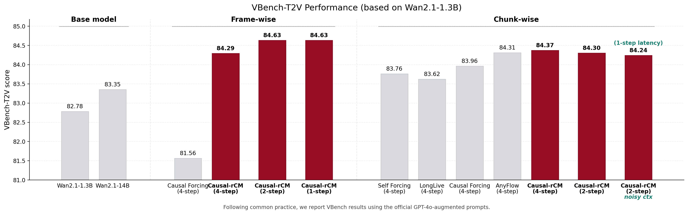
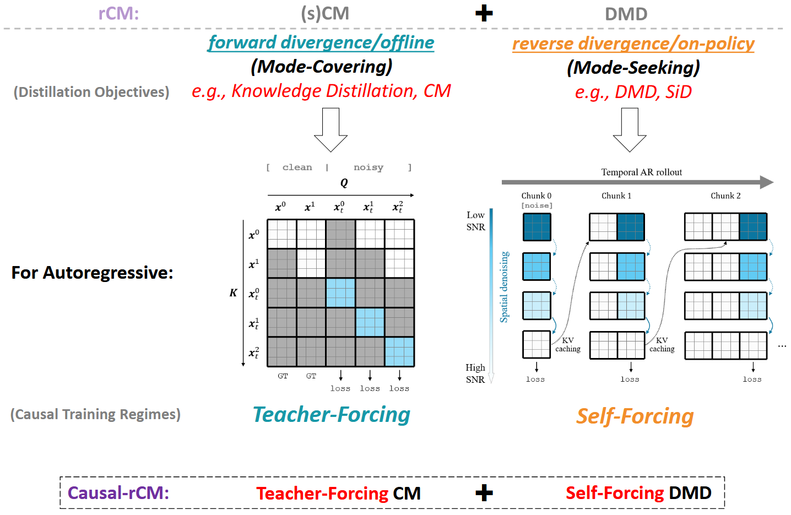
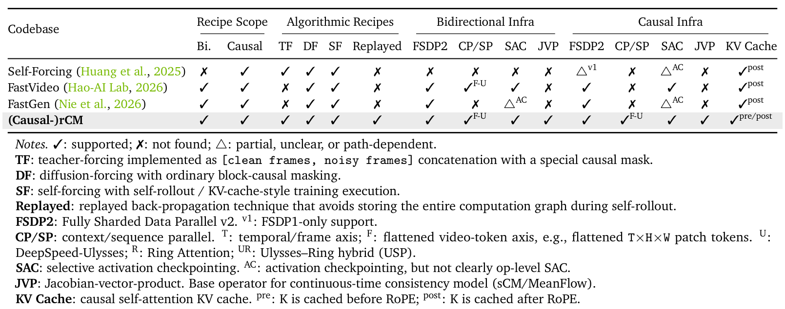

<h1 align="center"> rCM: Score-Regularized Continuous-Time Consistency Model </h1>
<h1 align="center"> Causal-rCM: Teacher-Forcing meets Self-Forcing in Autoregressive Diffusion Distillation for Streaming Video Generation and Interactive World Models </h1>
<h3 align="center"> 🚀State-of-the-Art JVP-Based Diffusion Distillation · Few-Step Video Generation · Scaling Up sCM/MeanFlow · Causal/Autoregressive Extension </h3>
<h3 align="center"> 🚀A Leading, Unified and Scalable Open-Source Algorithm-and-Infrastructure Recipe for Diffusion Distillation and Causal Training </h3>
<div align="center">
  <div>
  <p align="center" style="font-size: larger;">
    <strong>ICLR 2026</strong>
  </p>
  </div>
  <a href='https://arxiv.org/abs/2510.08431'></a>  &nbsp;
  <a href='https://research.nvidia.com/labs/dir/rcm'></a> &nbsp;
</div>

**Notice**: rCM now includes a ***causal/autoregressive training*** stack, showing how **teacher-forcing** (forward-divergence/offline) CM complements **self-forcing** (reverse-divergence/on-policy) DMD in autoregressive video diffusion distillation.

*Paper coming soon...*

<p align="center">

<p>

<p align="center">

  <p align="center">
    Illustration of <b>Causal-rCM</b>.
  </p>
<p>

## Causal-rCM / Autoregressive Training

This repository now supports advanced algorithms and infrastructure for autoregressive video diffusion training and distillation. Causal-rCM provides a state-of-the-art causal distillation recipe. See [`Causal_rCM.md`](Causal_rCM.md) for details.

Also included:
- Optimized causal inference with time benchmarking, quantized KV cache, and bounded-memory length extrapolation.
- Simplified and reproducible VBench evaluation suite.

<p align="center">

  <p align="center">
    Infrastructure comparison with other codebases.
  </p>
<p>

## Overview

rCM is the first work that:
- Scales up **continuous-time consistency distillation (e.g., sCM/MeanFlow)** to 10B+ parameter video diffusion models.
- Provides open-sourced **FlashAttention-2 Jacobian-vector product (JVP) kernel** with support for parallelisms like FSDP/CP.
- Identifies the quality bottleneck of sCM and overcomes it via a forward–reverse divergence joint distillation framework, showcasing how CM (**forward-divergence/offline** method) can complement DMD (**reverse-KL/on-policy** method) in enhancing diversity.
- Delivers models that generate videos with both **high quality and strong diversity in only 2~4 steps**.

#### Comparison with Other Diffusion Distillation Methods on Wan2.1 T2V 1.3B (4-step)

| teacher | DMD2 | SiD |
| :---: | :---: | :---: |
| <video src="https://github.com/user-attachments/assets/cdcd9fff-5ae9-4ba9-8864-4e1d733c1ce1" alt="teacher" controls></video> | <video src="https://github.com/user-attachments/assets/3f1ad494-9f13-4b2f-bf3e-b99ef98dbae4" alt="DMD2" controls></video> | <video src="https://github.com/user-attachments/assets/2cbd9f62-3d2a-4170-ad9a-a7f59d534ad3" alt="SiD" controls></video> |
|**sCM**|**rCM (Ours)**||
| <video src="https://github.com/user-attachments/assets/50693577-9a32-4b98-86ad-d4e1be4affdc" alt="sCM" controls></video> | <video src="https://github.com/user-attachments/assets/3da35a11-8ce6-4232-9aa2-6b3bc8b7cabf" alt="rCM" controls></video> | |

rCM achieves both **high quality** and **strong diversity**.

#### Performance under Fewer (1~2) Steps

| 1-step | 2-step | 4-step |
| --- | --- | --- |
| <video src="https://github.com/user-attachments/assets/fffab30d-de3f-4b86-b3b6-54208761d18b" alt="1-step" controls></video> | <video src="https://github.com/user-attachments/assets/e5477835-861f-4333-a99e-040b99186de5" alt="2-step" controls></video> | <video src="https://github.com/user-attachments/assets/8c39b50e-72df-411b-8c8e-ef69a5d3431f" alt="4-step" controls></video> |

#### 5 Random Videos with Distilled Wan2.1 T2V 14B (4-step)

<video src="https://github.com/user-attachments/assets/b1e3b786-134b-429d-b859-840646502c9b" controls></video>

## Environment Setup
Our training and inference are based on native PyTorch, completely free from `accelerate` and `diffusers`.

```bash
conda create -n rcm python==3.12.12
conda activate rcm
conda install cmake ninja
conda install -c nvidia cuda-nvcc cuda-toolkit
# depending on your cuda version
pip install torch==2.11.0 torchvision==0.26.0 --index-url https://download.pytorch.org/whl/cu126
# misc
pip install megatron-core hydra-core loguru attrs fvcore nvidia-ml-py imageio[ffmpeg] pandas wandb psutil ftfy regex transformers webdataset safetensors
# transformer_engine
pip install --no-build-isolation transformer_engine[pytorch]
# FlashAttention-2
git clone https://github.com/Dao-AILab/flash-attention.git
cd flash-attention
git checkout v2.7.4.post1
MAX_JOBS=4 python setup.py install

# (Optional) FlashAttention-3 dense attention backend on Hopper.
git checkout main
cd hopper
MAX_JOBS=4 python setup.py install
python -c "import flash_attn_interface; print('FA3 installed')"
cd ..

# (Optional) FlashAttention-4 / CuTeDSL backend for PyTorch FlexAttention on Hopper and Blackwell.
pip install flash-attn-4
# For CUDA 13, use: pip install "flash-attn-4[cu13]"
python -c "from flash_attn.cute import flash_attn_func; print('FA4 installed')"
export RCM_FLEX_BACKEND=flash  # use "auto" or "triton" to fall back to PyTorch FlexAttention defaults
cd ..

# (Optional) MagiAttention backend for masked attention
git clone https://github.com/SandAI-org/MagiAttention.git
cd MagiAttention
git submodule update --init --recursive
pip install -r requirements.txt
# MagiAttention recommends CUDA 13+; for CUDA 12.x builds (e.g. cu126 above), explicitly allow it:
# export MAGI_ATTENTION_ALLOW_BUILD_WITH_CUDA12=1
# For Ampere/Blackwell FA4 paths, set the MagiAttention FA4 envs before install as needed:
# export MAGI_ATTENTION_PREBUILD_FFA=0
# export MAGI_ATTENTION_FA4_BACKEND=1
pip install --no-build-isolation .
cd ..
export RCM_ATTENTION_BACKEND=magi
```

## Inference

Below is an example inference script for running rCM on T2V:

```bash
# Basic usage:
#   PYTHONPATH=. python rcm/inference/wan2pt1_t2v_rcm_infer.py [arguments]

# Arguments:
# --model_size         Model size: "1.3B" or "14B" (default: 1.3B)
# --num_samples        Number of videos to generate (default: 1)
# --num_steps          Sampling steps, 1–4 (default: 4)
# --sigma_max          Initial sigma for rCM (default: 80); larger choices (e.g., 1600) reduce diversity but may enhance quality
# --dit_path           Path to the distilled DiT model checkpoint (REQUIRED for inference)
# --vae_path           Path to Wan2.1 VAE (default: assets/checkpoints/Wan2.1_VAE.pth)
# --text_encoder_path  Path to umT5 text encoder (default: assets/checkpoints/models_t5_umt5-xxl-enc-bf16.pth)
# --prompt             Text prompt for video generation (default: A stylish woman walks down a Tokyo street...)
# --resolution         Output resolution, e.g. "480p", "720p" (default: 480p)
# --aspect_ratio       Aspect ratio in W:H format (default: 16:9)
# --seed               Random seed for reproducibility (default: 0)
# --save_path          Output file path including extension (default: output/generated_video.mp4)


# Example
PYTHONPATH=.  python rcm/inference/wan2pt1_t2v_rcm_infer.py \
    --dit_path assets/checkpoints/rCM_Wan2.1_T2V_1.3B_480p.pt \
    --num_samples 5 \
    --prompt "A cinematic shot of a snowy mountain at sunrise"
```

See [Wan examples](Wan.md) for additional usage and I2V examples.

For Causal-rCM inference, I2V, quantized KV cache, length extrapolation, and training recipes, see [`Causal_rCM.md`](Causal_rCM.md).

## Training
In this repo, we provide training code based on Wan2.1 and its synthetic data.

Advanced training infrastructure:
- **FSDP2**. Adjust by setting `model.config.fsdp_shard_size`.
- **Ulysses Context Parallel (CP)**. Adjust by setting `model_parallel.context_parallel_size`. Ulysses CP requires that the CP size is a factor of `num_heads` (12 for Wan2.1 1.3B, 40 for Wan2.1 14B). When enabling CP, ensure that the number of GPUs is divisible by the chosen CP size. The effective batch size is reduced by a factor of the CP size. 
- **Selective Activation Checkpointing (SAC)**. Adjust by setting `model.config.net.sac_config.mode`.
- **Gradient Accumulation**. Adjust by setting `trainer.grad_accum_iter`.

Distillation baselines (dCM, sCM, DMD):
- **Discrete-time CM (JVP-free)** by setting `model.config.cm_type=dcm` and optionally disabling the DMD loss (setting `model.config.net_fake_score=null` or `model.config.loss_scale_dmd=0`).
- **Pure sCM distillation (JVP-based)** by setting `model.config.net_fake_score=null` or `model.config.loss_scale_dmd=0`.
- **Pure DMD distillation (JVP-free)** by disabling the CM loss (setting `model.config.loss_scale=0`), and optionally fixing the backward simulation timesteps to predetermined values (setting `model.config.dmd_fix_timesteps=True`, recommended).

**Note**: sCM + DMD joint training may be unstable for some models. We recommend **a most robust way of applying rCM: splitting the distillation process into separate stages (dCM (warmup) -> sCM -> DMD (+sCM))**.

#### Key Components
- FlashAttention-2 JVP kernel: `rcm/utils/flash_attention_jvp_triton.py`
- JVP-adapted Wan2.1 student network: `rcm/networks/wan2pt1_jvp.py`
- Training loop: `rcm/models/t2v_model_distill_rcm.py`
- Causal training/distillation loop: `rcm/models/t2v_model_causal.py`
- Causal attention and KV-cache infrastructure: `rcm/utils/blockmask.py`, `rcm/utils/kv_cache.py`

#### Checkpoints Downloading
Download the Wan2.1 teacher checkpoints in `.pth` format and VAE/text encoder to `assets/checkpoints`:

```bash
# make sure git lfs is installed
git clone https://huggingface.co/worstcoder/Wan assets/checkpoints
```

rCM and Causal-rCM checkpoints can be placed in the same `assets/checkpoints` directory. See [`Causal_rCM.md`](Causal_rCM.md) for causal checkpoint naming and per-step inference commands.

Our code is based on FSDP2 and relies on [Distributed Checkpoint (DCP)](https://docs.pytorch.org/tutorials/recipes/distributed_checkpoint_recipe.html) for loading and saving checkpoints. Before training, optionally convert `.pth` teacher checkpoints to `.dcp` first (this step can be ommited now, because the current code also supports loading `.pth`/`.pt` directly):

```bash
python -m torch.distributed.checkpoint.format_utils torch_to_dcp assets/checkpoints/Wan2.1-T2V-1.3B.pth assets/checkpoints/Wan2.1-T2V-1.3B.dcp
```

After training, the saved `.dcp` checkpoints can be converted to `.pth` using the script `scripts/dcp_to_pth.py`.

#### Dataset Downloading

We provide Wan2.1-14B-synthesized dataset with prompts from [https://huggingface.co/gdhe17/Self-Forcing/resolve/main/vidprom_filtered_extended.txt](https://huggingface.co/gdhe17/Self-Forcing/resolve/main/vidprom_filtered_extended.txt). Download to `assets/datasets` using:

```bash
# make sure git lfs is installed
git clone https://huggingface.co/datasets/worstcoder/Wan_datasets assets/datasets
```

#### Start Training
Single-node training example:

```bash
WORKDIR="/path/to/rcm"
cd $WORKDIR
export PYTHONPATH=.

# the "IMAGINAIRE_OUTPUT_ROOT" environment variable is the path to save experiment output files
export IMAGINAIRE_OUTPUT_ROOT=${WORKDIR}/outputs
CHECKPOINT_ROOT=${WORKDIR}/assets/checkpoints
DATASET_ROOT=${WORKDIR}/assets/datasets/Wan2.1_14B_480p_16:9_Euler-step100_shift-3.0_cfg-5.0_seed-0_250K

# your Wandb information
export WANDB_API_KEY=xxx
export WANDB_ENTITY=xxx

registry=registry_distill
experiment=wan2pt1_1pt3B_res480p_t2v_rCM

torchrun --nproc_per_node=8 \
    -m scripts.train --config=rcm/configs/${registry}.py -- experiment=${experiment} \
        model.config.teacher_ckpt=${CHECKPOINT_ROOT}/Wan2.1-T2V-1.3B.dcp \
        model.config.tokenizer.vae_pth=${CHECKPOINT_ROOT}/Wan2.1_VAE.pth \
        model.config.text_encoder_path=${CHECKPOINT_ROOT}/models_t5_umt5-xxl-enc-bf16.pth \
        model.config.neg_embed_path=${CHECKPOINT_ROOT}/umT5_wan_negative_emb.pt \
        dataloader_train.tar_path_pattern=${DATASET_ROOT}/shard*.tar
```

Please refer to `rcm/configs/experiments/rcm/wan2pt1_t2v.py` for the 14B config or perform modifications as needed.

For causal training, see `rcm/configs/experiments/causal_rcm/wan2pt1_t2v.py` and [`Causal_rCM.md`](Causal_rCM.md).

## Future Directions

There are promising directions to explore based on rCM. For example:
- The Causal-rCM framework can be further scaled to longer-horizon interactive world models and richer streaming-generation settings.
- Few-step distilled models lag behind the teacher in aspects such as physical consistency; this can potentially be improved via reinforcement learning.

## Acknowledgement
We thank the [Cosmos-Predict2](https://github.com/nvidia-cosmos/cosmos-predict2) and [Cosmos-Predict2.5](https://github.com/nvidia-cosmos/cosmos-predict2.5) project for providing the awesome open-source video diffusion training codebase.

## Citation
```
@article{zheng2025rcm,
  title={Large Scale Diffusion Distillation via Score-Regularized Continuous-Time Consistency},
  author={Zheng, Kaiwen and Wang, Yuji and Ma, Qianli and Chen, Huayu and Zhang, Jintao and Balaji, Yogesh and Chen, Jianfei and Liu, Ming-Yu and Zhu, Jun and Zhang, Qinsheng},
  journal={arXiv preprint arXiv:2510.08431},
  year={2025}
}
@article{zheng2026causal,
  title={Causal-rCM: Teacher-Forcing meets Self-Forcing in Autoregressive Diffusion Distillation for Streaming Video Generation and Interactive World Models},
  author={Zheng, Kaiwen and He, Guande and Zhao, Min and Zhu, Hongzhou and Zhang, Jintao and Chen, Huayu and Chen, Jianfei and Lin, Chen-Hsuan and Liu, Ming-Yu and Zhu, Jun and Ma, Qianli},
  journal={TODO},
  year={2026}
}
```
